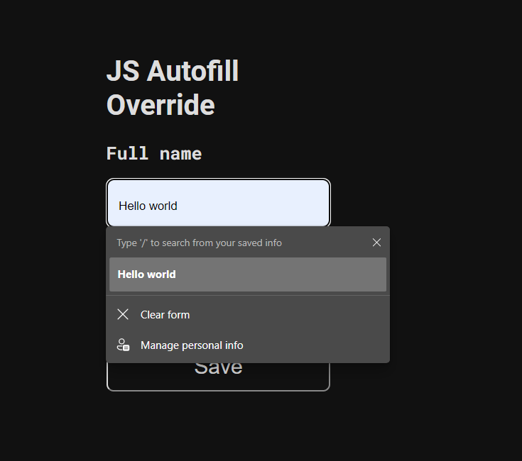
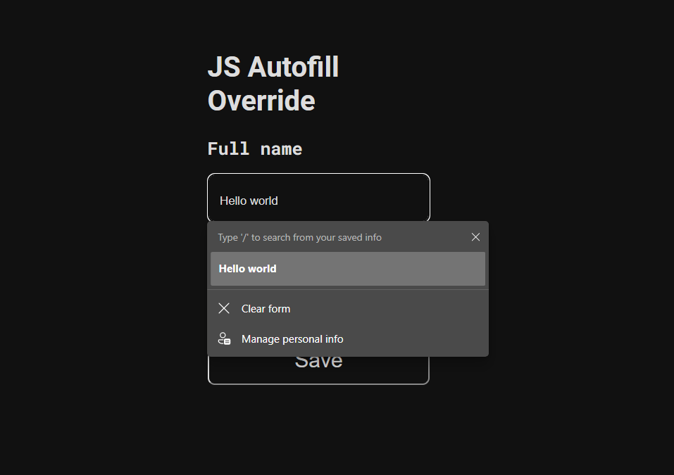

# js-autofill-override

Overriding autofill styles of input using CSS.

## How to run

1. Make sure you have Node.js installed.
2. Install project dependencies

    ```bash
    npm run install
    ```

3. Run the `dev` script to startup [Vite](https://vitejs.dev) server.

## Description

1. Before overriding

    

2. After overriding

    

The override code in [`style.css`](./style.css):

```CSS
body {
  --dark-color: #111;
  --light-color: #DDD;
  /*...*/
}
/*...*/

input:auto-fill {
  color: var(--light-color);
  box-shadow: inset 0 0 0 9999px var(--dark-color);
}

input:-webkit-autofill {
  -webkit-text-fill-color: var(--light-color);
  -webkit-box-shadow: inset 0 0 0 9999px var(--dark-color);
  box-shadow: inset 0 0 0 9999px var(--dark-color);
}
```
